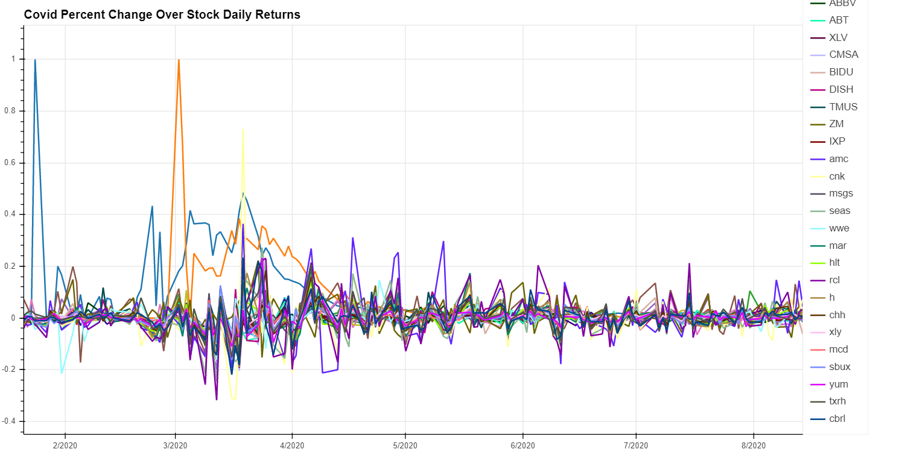

Fintech Group Project 1
ASU Fintech Fall 2020 Course
Group 1:
Sheldon Harracksingh
Xavier Spurlock
Richard Ripley

Hypothesis: Measuring COVID's effect on the stock market this year. Specifically, as it pertains to certain sectors leading up to, and during, the lockdown here in the US. We feel that the COVID lockdown would decimate certain sectors, such as Transportation and Entertainment; while others, like Tech, would benefit greatly. Once the Stimulus Package was sent out, investors would ride the wave of the hot sectors while leaving the forgotten ones behind. We expect the trend to continue forward, so long as COVID supresses our usual economy.

Sources: We pulled COVID 19 data from the New York Times Github to reference case numbers at the beginning of this year. For our stock data, we utilized Pandas DataReader via Yahoo Finance.

Breakdown: Each of us chose two sectors and ran numerous analyses to find the Covid effect on our markets. We felt this would even out the workload, while allowing each of us to hone our skills with data scrubbing, plotting, and interpreting. Once done, we combined all of our charts into a dashboard for presentation and accessability.
